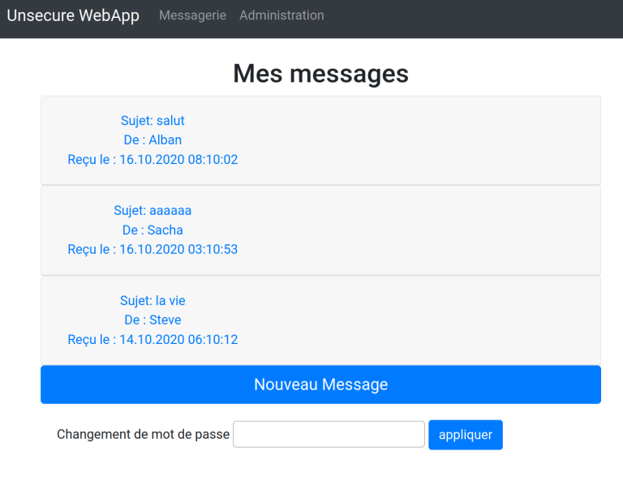

# UnsecureMailApp - Manuel de l'utilisateur

```
Auteurs:
Sacha Perdrizat
Alban Favre
```

## Introduction

Ce guide succint vous guidera dans l'installation et l'utilisation de notre application.

### Installation

1. cloner le repository github (ou décompresser l'archive fournie)

```bash
$ git clone git@github.com:Sinyks/STI-UnsecureMailApp.git
```
2. A la racine du projet lancer le fichier  `start.sh`

```
$ cd STI-UnsecureMailApp
$ ./start.sh
```
3. le site est maintenant lancé vous pouvez vous y rendre sur http://localhost:8080
4. Pour terminer la tâche du serveur lancer le script ``./stop.sh``

## Contenue de la base de donnée

Les personnes suivantes existent déjà dans la base de donnée: (__Attention à la casse des noms__ )

| Nom d'utilisateur | Mot de passe | rôle           | Validité |
| ----------------- | ------------ | -------------- | -------- |
| carl              | pass         | collaborateur  | valide   |
| Sacha             | 1234         | Administrateur | valide   |
| Alban             | 1234         | Administrateur | valide   |
| Steve             | 1234         | Collaborateur  | valide   |
| Daniel            | 1234         | Collaborateur  | invalide |


## Se connecter au site

Pour vous connecter au site rendez sur http://localhost:8080, et remplissez le formulaire avec votre identifiant et mots de passe.


## Ecrire un message

Une fois connecté vous atterrissez sur votre tableaux de bord, d'ici la vous pourrez lire les messages reçu en cliquant dessus.




Et écrire des messages à vos contact en faisant ``Nouveau Message``.


Vous obtiendrez un message vous indiquant que l'envoi s'est correctement effectué.

## Répondre aux messages

Depuis le tableau de bord vous avez également la possibilité de répondre aux messages que l'on vous a envoyés, pour cela faites dérouler le message et faite ``Répondre``, vous allez entrer sur une nouvelle page vous invitant à rédiger votre réponse.


## Supprimer un message

En cliquant sur ``supprimer`` vous allez supprimer le message et il disparaîtra de votre tableau de bord.

## Changer son mot de passe

Si d'aventure vous désirez changer votre mot de passe, un formulaire en bas de votre tableau de bord vous permettra de le modifier


## Console d'administration

La console d'adminitration n'est visible que si vous êtes administrateur.


En vous y rendant vous aurez la possibilité d'administrer,créer et supprimer des utilisateurs de l'application.

### Création d'utilisateur


### Suppression d'utilisateur
__Attention la suppresssion d'un utilisateur est définitive__


